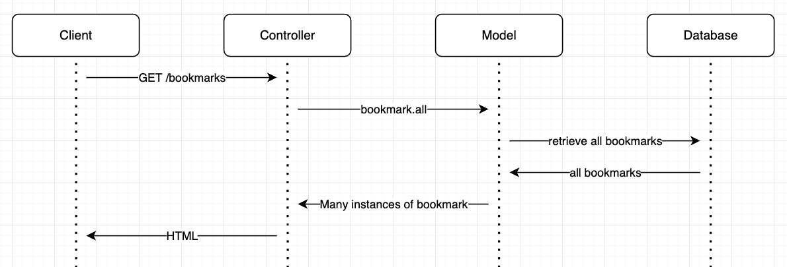

# Bookmark Manager

User Stories
```
As a user
So that I can easily visit websites I enjoy
I would like to view a list of saved bookmarks

As a user
So that I can add websites I enjoy
I would like to view create new bookmarks
```
As a user so that I can visit websites I enjoy looking at I would like to be able to view a list of saved bookmarks. 



# Setup for Production

1. Connect to PostgreSQL

```
$ psql  
```

2. Create bookmark_manager database

```
$ CREATE DATABASE bookmark_manager;
```

3. Connect to database

```
$ \c bookmark_manager;
```

4. Run query in database_setup.sql

```
$ \i db/migrations/database_setup.sql
```

# Setup for Test

1. Connect to PostgreSQL

```
$ psql  
```

2. Create bookmark_manager_test database

```
$ CREATE DATABASE bookmark_manager_test;
```

3. Connect to database

```
$ \c bookmark_manager_test;
```

4. Run query in database_setup.sql

```
$ \i db/migrations/database_setup.sql
```
